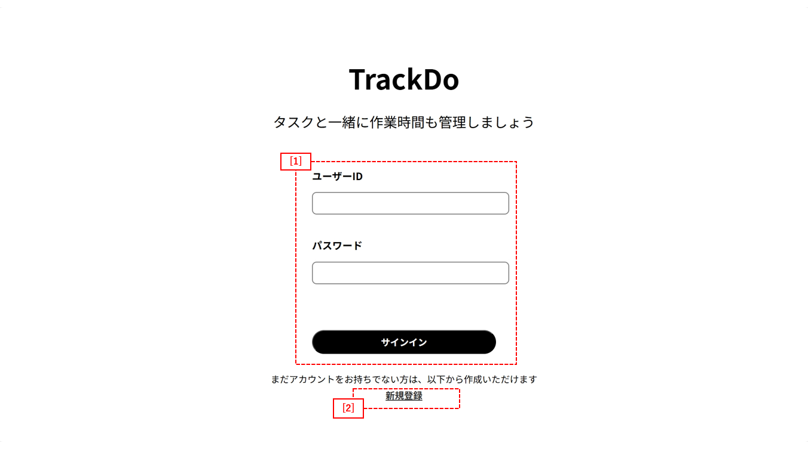
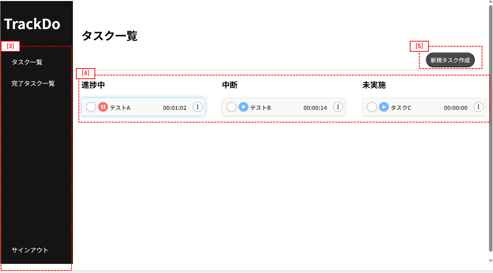
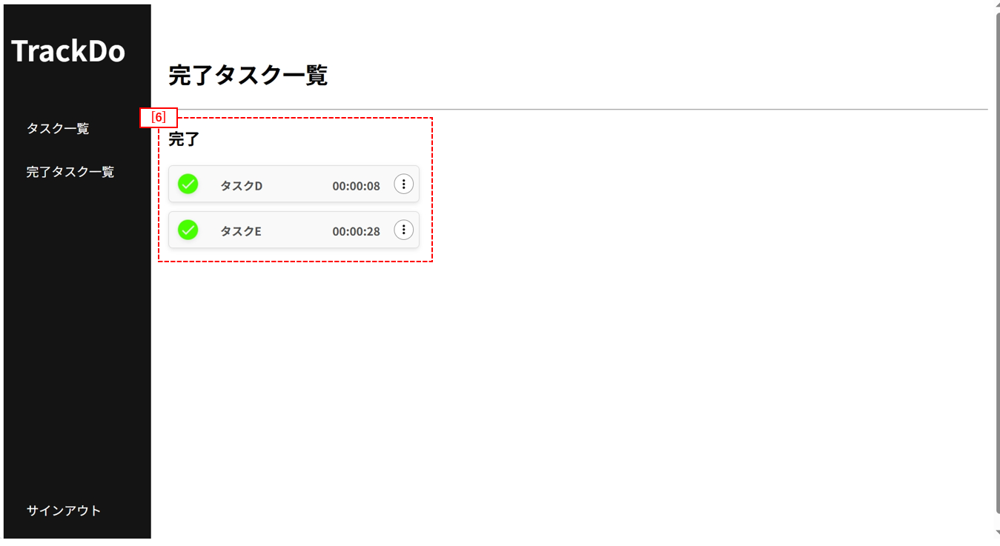
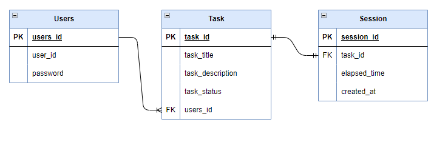

## ■アプリ概要  
作業時間を自動で記録してくれるToDoアプリです。タスクは"未実施"、"中断"、"進捗中"、"完了"の4つのステータスで管理され、状況に応じてタイマーが開始/停止します。  
記録された時間はタスクごとに蓄積され、タスクごとに作業時間の振り返りが可能です。手動で記録する手間を減らし、業務の見える化や自己管理をサポートします。  

アプリURL：https://auto-todo-tracker.vercel.app/  
**※詳細説明・注意点については本READMEの後半部をご確認ください。**

  
## ■開発背景  
前職では、Jiraというプロジェクト管理ツールを使ってプロジェクト管理を進めていました。Jiraではタスク完了時に所要時間を手動で記録する必要がありましたが、複数人で複数作業を並行して進めていると、正確な所要時間を思い出すのが難しいという課題に直面しました。 

また、マネジメント業務として新卒メンバーの進捗確認も担当していましたが、作業ごとの所要時間や遅れの原因が可視化されていないことで、スムーズな進捗把握が難しく、改善の糸口を見つけることにも苦労しました。  

こうした課題から、**タスクの所要時間を自動的に記録し、業務実績や負荷を可視化するツール**の必要性を感じ、本アプリの開発に至りました。

類似サービスがないか簡単に調査したところ、計測機能付きのプロジェクト管理ツールはいくつか存在していましたが、個人でも気軽に扱えるシンプルなツールは多くありませんでした。そのため、現状の技術力を考慮したうえで、本アプリでは個人向けにフォーカスする形で開発を進めました。  

  
## ■想定ユーザー  
業務経験が浅く、作業時間の見積もりや報告に不安があるエンジニアや新卒メンバー  
個人で作業することが多く、進捗の可視化などがしにくい在宅ワーカー  

  
## ■使用技術  
### フロントエンド 
・React[js] (v19.1.0)
### バックエンド  
・Spring Boot 3 (v3.4.5) 
###  データベース  
・MySQL  
### インフラ  
・Vercel(フロントエンド)    
・Railway(バックエンド,データベース)  

  
## ■主な機能一覧  
### タスク作成機能  
タスクを作成し、タスク一覧へ追加する機能。

### タスク編集機能  
タスク一覧のタスクに対して、タイトルや説明を編集できる機能。

### タスク削除機能  
タスク一覧のタスクに対して、削除を実施する機能。  

### タスク遷移機能  
タスクを開始、中断、完了、再開させると、自動でグルーピングされる機能。

### 自動計測機能  
タスク開始時から完了時まで計測を実施する機能。  

### ユーザー機能  
サインイン、サインアウト、サインアップ、認証の機能を提供し、個々でのタスク管理を提供する機能。  

  
## ■詳細説明  
### ▶ホーム画面説明  
サインイン、サインアップが可能です。本ポートフォリオでは各企業様ごと専用のアカウントを用意しておりますので、そちらでサインインお願いいたします。 

    

  
[1]：サインイン機能の提供。 

[2]：サインアップ機能の提供。 

### ▶タスク一覧画面説明  
タスク作成、タスク詳細、タスク編集、タスク削除、計測開始/停止機能を提供しております。   

  

  
[3]：各種ページへの遷移ボタンおよびサインアウト機能。 

[4]："進捗中"、"中断"、"未実施"におけるタスクカード。"▶"または"||"でタイマー機能をご利用いただけます。カード右部の3点メニューからタスク詳細、編集、削除機能をご利用いただけます。  

[5]：タスク作成機能の提供。    

### ▶完了タスク一覧画面説明  
タスク詳細、タスク削除を提供しております。  

  

  
[6]："完了"におけるタスクカード。カード右部の3点メニューからタスク詳細、削除機能をご利用いただけます。   
  
上記が本アプリの主な利用機能になります。    
かなり小規模なアプリではありますが、操作感や画面構成をご確認いただければ幸いです。

  
## ■注意点・推奨事項など  
本アプリを使用するにあたって、以下の点にご注意ください。  

### 1.推奨ブラウザ：Google Chrome  
本アプリでは、ユーザー認証にセッション方式を採用しており、サインイン後に発行される "JSESSIONID" をブラウザのセッションCookieとして保持し、各リクエスト時に自動的に送信する仕組みになっています。  

しかし、Microsoft Edge ではデフォルト設定によりサードパーティCookieの送信がブロックされるケースがあり、**一部リクエストが認証されず失敗する問題**が確認されています。そのため、"Google Chromeでのご利用を強く推奨"しております。  

※この挙動は開発中に発見したものであり、認証方式選定時の反省点および今後の改善ポイントとして認識しています。

### 2.同端末での複数ユーザー持ちは非推奨  
同一端末で複数のユーザーアカウントを切り替えて利用した際に、状態復元（バックアップ）機能の挙動に不整合が発生する場合があります。  
このため、現在は1端末につき1ユーザーでのご利用を推奨しております。

※この挙動も開発中に発見したものであり、要件定義時の反省点および今後の改善ポイントとして認識しています。  

  
## ■今後の展望  
現アプリの課題点として主に以下の点が残っております。  

### 不具合修正  
先ほどあげた2点含め、細かい不具合やUI崩れなどがいくつか発生しているため、仕様変更や修正を進めていきます。

### アプリ最適化  
現状、タスクの状態遷移において若干のラグが発生しており、体感的なパフォーマンスの課題を感じています。要因としては、useStateやuseEffectの過剰な使用、およびuseMemoやuseCallbackなどの最適化手法を十分に活用できていないことだと考えております。今後はパフォーマンスの可視化を行った上で、アプリの最適化を進めていきたいと考えております。

### UI/UXのブラッシュアップ  
現状のUI/UXはまだ発展途上であり、最低限の機能提供にとどまっていると認識しています。また、レスポンシブ対応など実装できておらず、cssのリファクタリングなども含めブラッシュアップできればと考えております。  

### データ可視化機能の追加  
本来であれば、完了タスクの計測結果の可視化や作業ログ表示機能など業務の可視化及び改善に役立つ機能の提供を実装すべきでしたが、現状の技術力と時間では転職活動時には間に合いませんでした。今後、個人学習の一環として順次機能追加を進めていく予定です。

  
## ■ドキュメント一覧  
- [要件定義書（.md）] [要件定義書](./docs/要件定義書_Ver.6.md)    
- [テスト仕様書]    
Excel:[テスト仕様書](./docs/テスト仕様書_Ver.3.0.xlsx)   
スプレッドシート: https://docs.google.com/spreadsheets/d/178r5D-hBo0YdGcf-0ilmWNTVHcClXGsz/edit?usp=sharing&ouid=111410923100768686440&rtpof=true&sd=tru      
- [テーブル定義書]    
Excel:[テーブル定義書](./docs/テーブル設計書_Ver.3.xlsx)    
スプレッドシート: https://docs.google.com/spreadsheets/d/1KLqVDZq7lK9nB-SPuWL5HycGD48rChxH/edit?usp=sharing&ouid=111410923100768686440&rtpof=true&sd=true     
- [ER図（PNG）]
   

  
## ■備考  
本アプリの開発にあたっては、設計・開発・リファクタリング・テストのすべての工程でChatGPTをフルスタックエンジニアのメンターとして活用いたしました。    
あくまで補助的な使い方を心掛け、受動的ではなく、自ら考えて主体的に活用しました。
