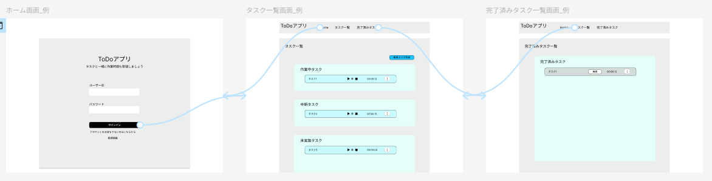
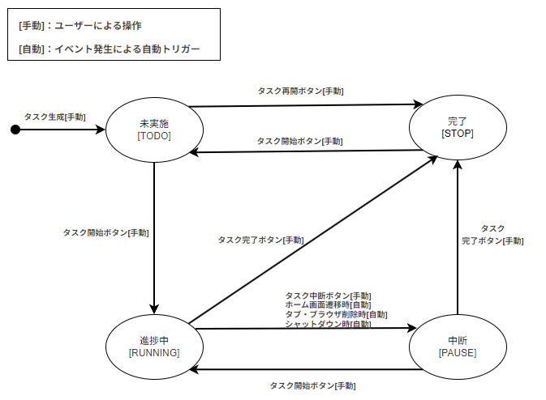

# 要件定義内容

## ■開発背景
前職では、Jiraというプロジェクト管理ツールを使ってプロジェクト管理を進めていました。Jiraではタスク完了時に所要時間を手動で記録する必要がありましたが、複数人で複数作業を並行して進めていると、正確な所要時間を思い出すのが難しいという課題に直面しました。 

また、マネジメント業務として新卒メンバーの進捗確認も担当していましたが、作業ごとの所要時間や遅れの原因が可視化されていないことで、スムーズな進捗把握が難しく、改善の糸口を見つけることにも苦労しました。  

こうした課題から、**タスクの所要時間を自動的に記録し、業務実績や負荷を可視化するツール**の必要性を感じ、本アプリの開発に至りました。

  
## ■想定ユーザー  
業務経験が浅く、作業時間の見積もりや報告に不安があるエンジニアや新卒メンバー  
個人で作業することが多く、進捗の可視化などがしにくい在宅ワーカー  

  
## 使用技術  
- フロントエンド   
React [ js ] (19.1.0)
- バックエンド  
Spring Boot 3 (Ver.3.4.5) 
- データベース  
MySQL  
- インフラ  
Vercel(フロントエンド)    
Railway(バックエンド,データベース)  

  
## ■画面構成 
### 画面概要
- **ホーム画面**  
アプリ起動時に最初に表示される画面。  
サインアップ（新規登録）とサインイン機能を提供。  
すでに認証済みのユーザーは、自動的にタスク一覧画面へ遷移する。

- **タスク一覧画面**  
進捗中・中断・未実施のタスクを一覧表示。  
タスクの作成や、進行中タスクの確認が可能。  
未認証の場合はホーム画面へリダイレクトされる。

- **完了タスク一覧画面**  
完了済みのタスクのみを一覧表示。  
こちらも未認証状態ではホーム画面へリダイレクトされる。  

  
### 初期画面遷移図  
※設計初期のものであり、最終的なUIとは異なります。全体の遷移イメージの参考として掲載しております。

### 認証維持と画面遷移の仕様
以下は、タブ・ブラウザ削除操作/リロード操作、シャットダウン後の復帰時における、各画面での認証状態に応じた遷移挙動です。

| 画面名              | 未認証状態で復帰した場合                      | 認証済み状態で復帰した場合(タブ削除) |認証済み状態で復帰した場合(その他※1) |
|---------------------|-----------------------------------------------|---------------------------------|---------------------------------|
| ホーム画面          | 状態変化せず、引き続きホーム画面を表示する | タスク一覧画面へ自動遷移する |状態変化せず、引き続きホーム画面を表示する 
| タスク一覧画面      | 該当せず | タスク一覧画面にとどまる。        |該当せず |
| 完了タスク一覧画面  | 該当せず | タスク一覧画面へ自動遷移する     | 該当せず|

※1：ブラウザ削除、シャットダウン時などを想定。

  
## ■主な機能一覧  
- **タスク作成機能**  
タスクを作成し、タスク一覧へ追加する機能。

- **タスク編集機能**  
タスク一覧のタスクに対して、タイトルや説明を編集できる機能。

- **タスク削除機能**  
タスク一覧のタスクに対して、削除を実施する機能。  

- **タスク遷移機能**  
タスクを開始、中断、完了、再開させると、自動でグルーピングされる機能。

- **自動計測機能**  
タスク開始時から完了時まで計測を実施する機能。

- **ユーザー機能**  
サインイン、サインアウト、サインアップ、認証の機能を提供し、個々でのタスク管理を提供する機能。

  
## ■タスク遷移機能の仕様について
### 概要
- タスクを開始、中断、完了させると、自動でグルーピングされる機能。  
### 仕様
- タスクステータスは"未実施"、"進捗中"、"中断"、"完了"の4つとする。  
　"未実施"：タスク生成時の初期ステータス。      
　"進捗中"：タスクを開始させた後に遷移するステータス。    
　"中断"：タスクを中断させたときに遷移するステータス。  
　"完了"：タスク完了時に遷移するステータス。  
- 本アプリでは計測できるタスクは最大1つとする。そのため、進捗中タスクは必ず1つ以下であること。  
- 進捗中タスクが存在する場合に、他タスクを進捗中に遷移させようとした場合は、進捗中タスクが中断することをユーザーに伝えること。
- ステータスの遷移については以下状態遷移図参照。
  

  
## ■タスク作成の仕様について
### 概要
- タスクを作成し、タスク一覧へ追加する機能。
### 仕様
- タスク名は20字以内であり、未入力またはスペースのみの文字列でないこと。条件に抵触する場合は入力フォームにてユーザーに伝えること。    
- タスク説明は256字以内であること。条件に抵触する場合は入力フォームにてユーザーに伝えること。     
- 作成できるタスクの最大数は50個であること。すなわち、各ステータスの総タスク数が50個を超えた場合は新規作成できないこと。   
- タスク作成時は、ステータス初期値として"未実施"、タスク作成日として作成時の日付(yyyy-mm-dd)を保持させること。  
(タスク数制限、文字数制限の意図として明確な理由はないが、上限を決めないとバグの温床になりかねないため、現時点では仕様上の上限値として暫定的に設定。)  

  
## ■タスク編集の仕様について  
### 概要
- タスクに対して、タイトルや説明を編集できる機能。  
### 仕様  
- 各タスクは作成後にユーザー操作によってタスク名とタスク説明を編集できること。 
- タスク名は20字以内であり、空白またはスペースのみの文字列でないこととする。条件に抵触する場合は入力フォームにてユーザーに伝えること。    
- タスク説明は256字以内であることとする。条件に抵触する場合は入力フォームにてユーザーに伝えること。  
- 編集機能については未完了タスクのみに提供する。すなわち、完了タスクでは編集機能は使用できないこと。  
(文字数制限の意図として明確な理由はないが、上限を決めないとバグの温床になりかねないため、現時点では仕様上の上限値として暫定的に決定。)      

  
## ■タスク削除の仕様について  
### 概要
- タスクに対して、削除を実施する機能。
### 仕様 
- 各タスクは作成後にユーザー操作によって削除できること。  
- 削除は完全削除とし、復元機能などは提供しない。
- 上記に伴いタスク削除は取り消しできない操作のため、削除前にユーザーへ確認モーダル(キャンセルor削除)を表示すること。   

  
## ■タスク計測の仕様について  
### 概要
- タスク開始時から完了時まで計測を実施する機能。
### 仕様
- 同時に計測できるタスクは１つとする。 
- 計測単位は秒(sec)とし、タスクごとに累積時間を保持する。 
- タスクが進捗中へ遷移したときに計測を開始し、中断、完了に遷移したときに計測を停止する。  
- タスクが進捗中状態の場合にタブ、ブラウザを閉じた時またはpcをシャットダウンしたときは、計測を停止する。  
- タスクが進捗中状態の場合にホーム画面に遷移した際も計測を停止する。
- 計測可能時間は359,999sec(99時間59分59秒)までとする。  
(計測可能時間の意図としては、画面に表示する際に2桁：2桁：2桁で一番美しいと感じたため)  

  
## ■ユーザー機能の仕様について  
### 概要  
- サインイン、サインアウト、サインアップ、認証の機能を提供し、個々でのタスク管理を提供する機能。  
### 仕様  
- **サインイン**    
ユーザーは、登録済みのユーザーIDおよびパスワードを用いてサインインできること。  
入力内容が正しければ、サインイン処理を実行し、タスク管理画面に遷移する。  
入力が誤っている場合は、該当する理由（例：パスワードが一致しない等）を通知すること。  
- **サインアウト**  
ユーザーは任意のタイミングでサインアウトできること。  
サインアウト時には、進行中のタスク計測があれば中断されること。  
サインアウト後は、認証が必要なページへのアクセスが制限されること。    
- **サインアップ**  
・ユーザーがユーザーIDとパスワードを用いて、新規アカウントを登録できるようにすること。  
・ユーザーIDは4文字以上20文字以内 かつ 同名IDを禁止すること。  
(意図：IDはある程度の意味性が欲しいため最低は4文字で。最大数は実装の都合上、現時点では仕様上の上限値として暫定的に設定。)   
・パスワードは8文字以上64文字以下の英数字であること。  
(意図：最低8文字は色々なシステムに利用されていると感じたため。最大数に関しては、セキュリティ面で見た時にある程度の長さを入力できるようにしたいため。) 
・ユーザーIDまたはパスワード、どちらもバリデーションを行うが、内容の脆弱性に対する警告などは行わない。例：aiueo,12345 など  
- **認証**    
サインイン時には、入力されたユーザーIDおよびパスワードと、保持しているユーザーデータを照合する。  
一致する場合は認証成功とし、ユーザーのセッションを開始する。  
一致しない場合は、ユーザーにその旨を通知する。  
（開発時メモ：  
認証方式については、セッション方式かJWTか現時点で判断できる能力を持ち合わせていないので、とりあえずセッション方式で進める  
他にもパスワード再発行機能の実装を考えたが、なくてもユーザー機能として成り立つため優先度を下げる。）  

  
## ■補足：非機能要件について
本アプリはポートフォリオ用の個人開発アプリであること、また現時点での開発経験を踏まえ、非機能要件（性能、可用性、セキュリティなど）については明確な定義は行っておりません。

